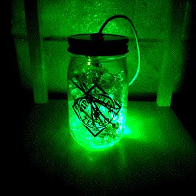

# Neon Brew

An Arduino program running on an Adafruit Flora with a NeoPixel. Cycles through the rainbow (gif below just shows first part). I connected the Flora and NeoPixel with alligator clips and stuffed it all into a jar.

Depends on [Adafruit_NeoPixel](https://github.com/adafruit/Adafruit_NeoPixel) library.

